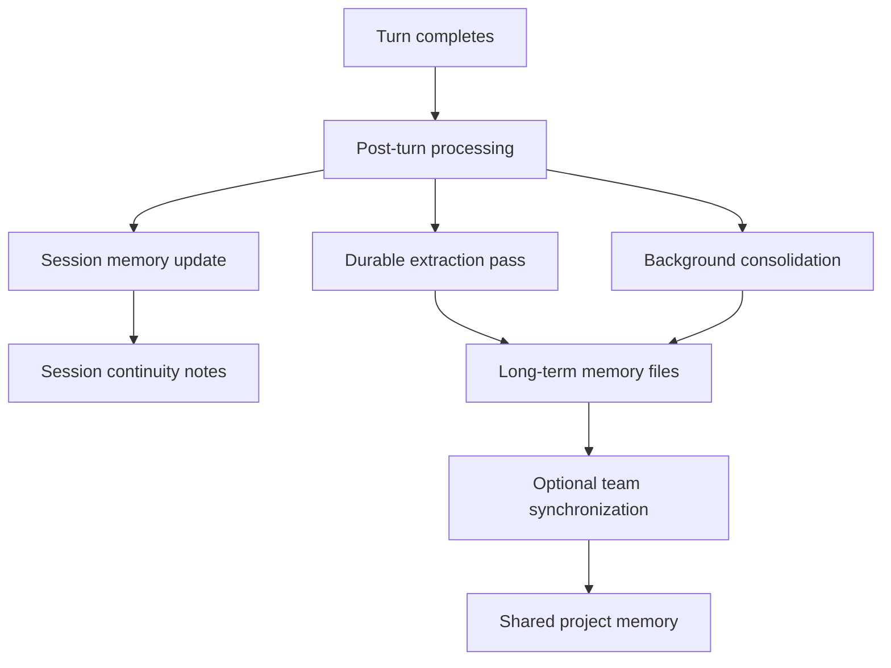
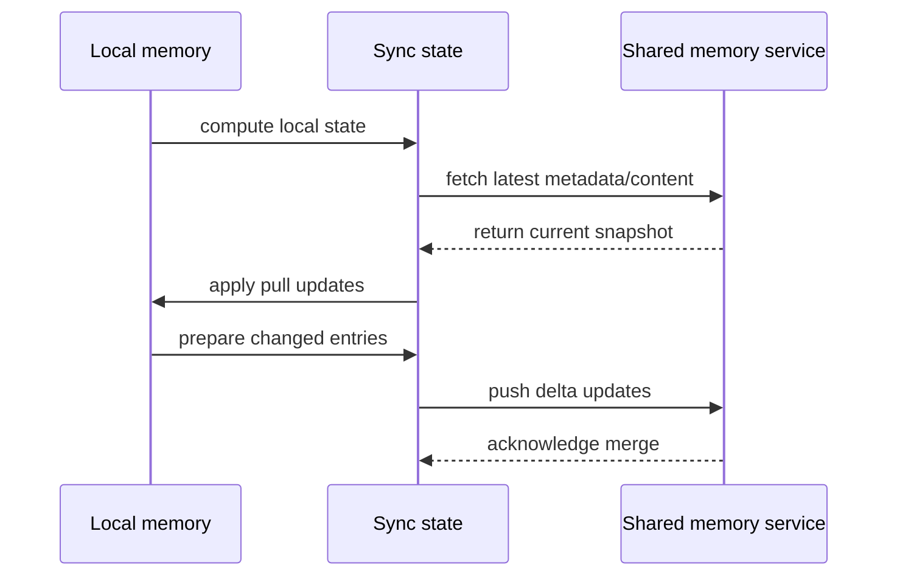

# How MEMORY Works

This article explains the MEMORY mechanism at a process level: how information is captured, consolidated, recalled, and synchronized.

## Why MEMORY Is Layered

The system uses three complementary layers:

- Session memory for short-horizon continuity inside active work.
- Durable memory for cross-session learning and reuse.
- Team memory for shared project context across collaborators.

## 1) Session Memory

Session memory maintains a structured working summary for continuity and compaction.

Key characteristics:

- runs after turns in a controlled update phase
- respects thresholds before updating
- preserves document structure to reduce drift
- focuses on near-term actionable context

## 2) Durable Memory

Durable memory captures reusable insights that should survive beyond a single session.

Key characteristics:

- separates index entries from detailed topic content
- enforces concise indexing for recall efficiency
- prefers updates/merge over duplicate creation
- applies strict write boundaries in memory-only regions

## 3) Background Consolidation

A scheduled consolidation pass improves quality over time:

- merges overlapping notes
- removes stale or contradictory facts
- keeps indexing concise and navigable
- favors durable signal over noisy activity logs

## 4) Team Synchronization

Team synchronization shares project-level memory through a pull-and-delta-push model.

## 5) Prompt Strategy

Prompting is split by purpose:

- policy prompts define what memory should contain
- update prompts maintain session continuity structure
- extraction prompts capture durable signal from recent work
- consolidation prompts improve long-term quality
- selection prompts keep recall focused and low-noise

## 6) Safety Boundaries

- strict mode and policy gates can disable automation paths
- memory writes are scoped to approved locations
- stale-memory awareness is built into recall guidance
- synchronization is checksum-driven to avoid unnecessary churn

In practice, the mechanism is designed to balance continuity, durability, and safety without overwhelming normal development flow.
