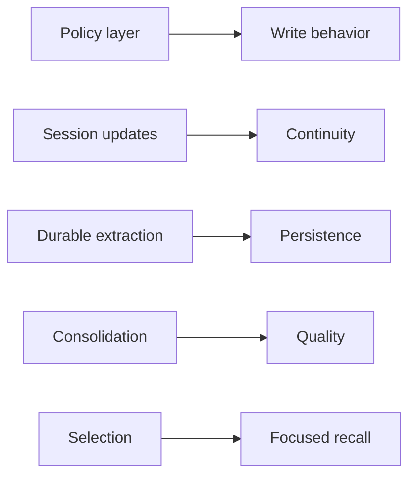

# MEMORY Prompts: Deep Dive

This document analyzes MEMORY prompt strategy without implementation-level naming. It focuses on intent, workflow fit, and control boundaries.

## Prompt Families and Their Jobs

| Prompt family | When it runs | Primary goal |
|---|---|---|
| Policy prompts | baseline runtime context | define memory taxonomy, exclusions, and usage boundaries |
| Session update prompts | post-turn continuity update | keep structured working summary accurate |
| Durable extraction prompts | post-turn fallback capture | persist reusable insights when not already saved |
| Consolidation prompts | periodic/background maintenance | merge, prune, and strengthen long-term quality |
| Selection prompts | recall-time filtering | choose only highly relevant memories for current task |

## 1) Policy Prompts

These prompts establish the behavioral contract:

- what is valid memory vs non-memory
- how to structure entries for future retrieval
- how to treat stale or conflicting recollections
- when memory should be ignored by explicit user request

## 2) Session Update Prompts

Session update prompts prioritize structured continuity:

- preserve the skeleton of the summary document
- refresh current state and recent outcomes
- reduce verbosity when sections become too large
- avoid contaminating notes with meta-instructions

## 3) Durable Extraction Prompts

Extraction prompts are efficiency-oriented:

- bounded to recent conversation signal
- prefer batch reads before batch writes
- discourage redundant investigation during extraction
- reinforce concise index plus rich topic-file pattern

## 4) Consolidation Prompts

Consolidation prompts are quality-oriented:

- reconcile drift and contradictions
- merge fragmented memories
- remove stale entries from indexes
- keep retrieval surfaces compact and high-signal

## 5) Selection Prompts

Selection prompts are precision-oriented:

- choose only memories with clear relevance
- allow empty output when confidence is low
- avoid repeating generic references when active context already covers them

## 6) Control Boundaries Around Prompts

Prompt instructions are paired with runtime controls:

- restricted capability surface during memory-focused runs
- location-constrained writes
- policy gates for feature availability
- conservative defaults when confidence is uncertain

## 7) Review Checklist

Use this checklist when evolving MEMORY prompts:

- Is the prompt solving a distinct stage problem?
- Does it avoid policy duplication across layers?
- Is it aligned with runtime enforcement rules?
- Will it reduce or increase duplicate memory artifacts?
- Does it preserve freshness and anti-drift behavior?
- Does it improve retrieval quality without adding noise?
