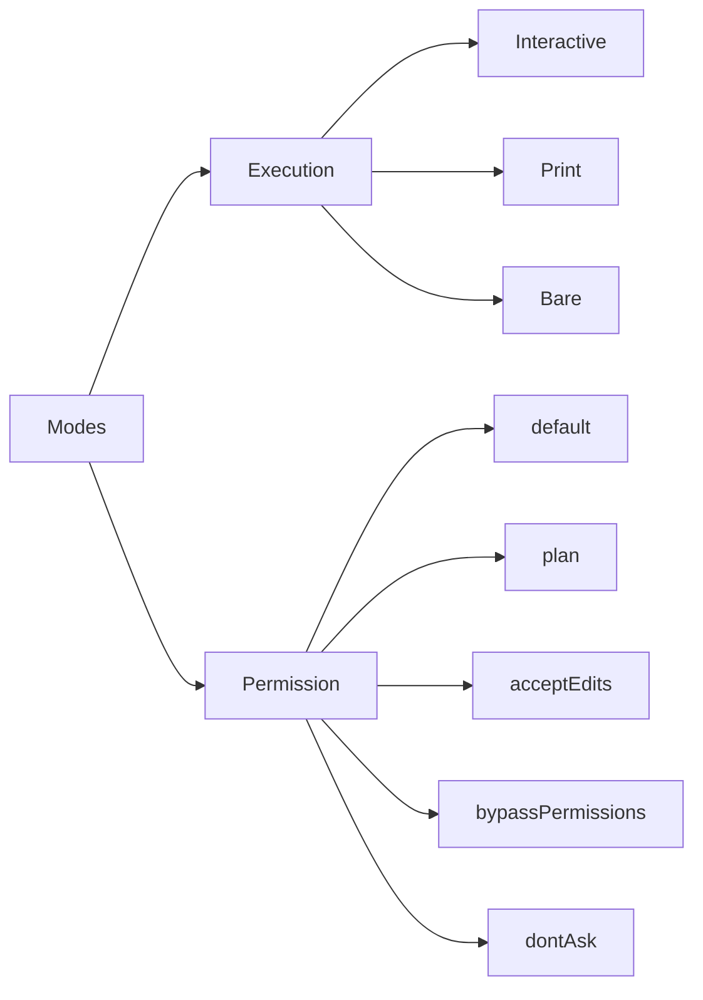
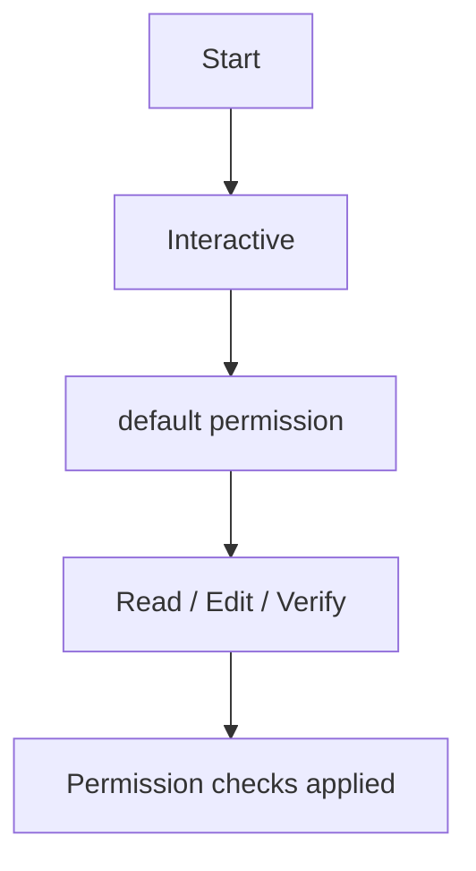
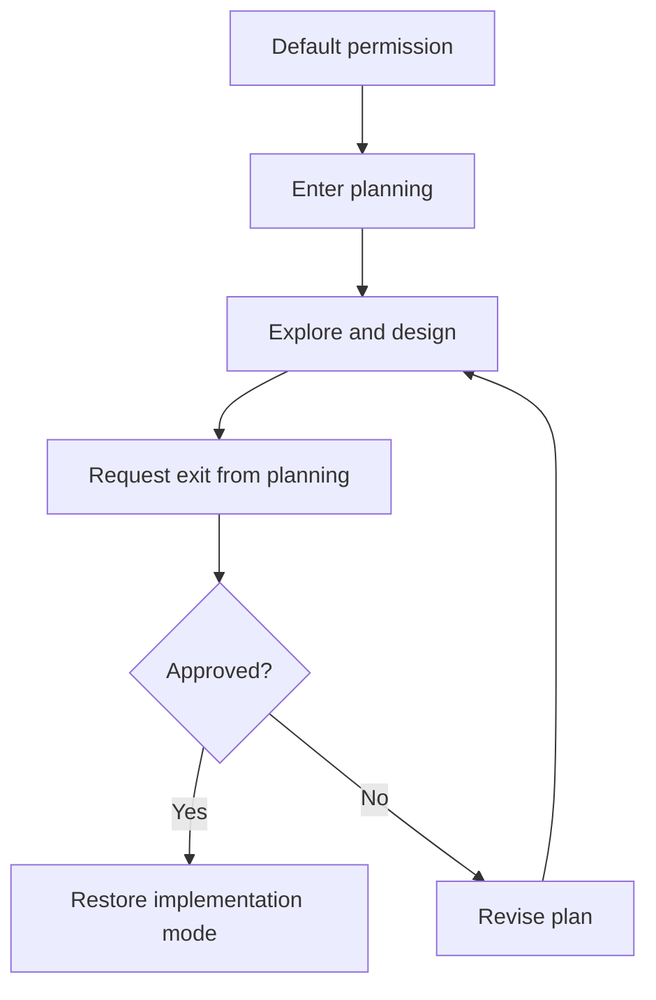
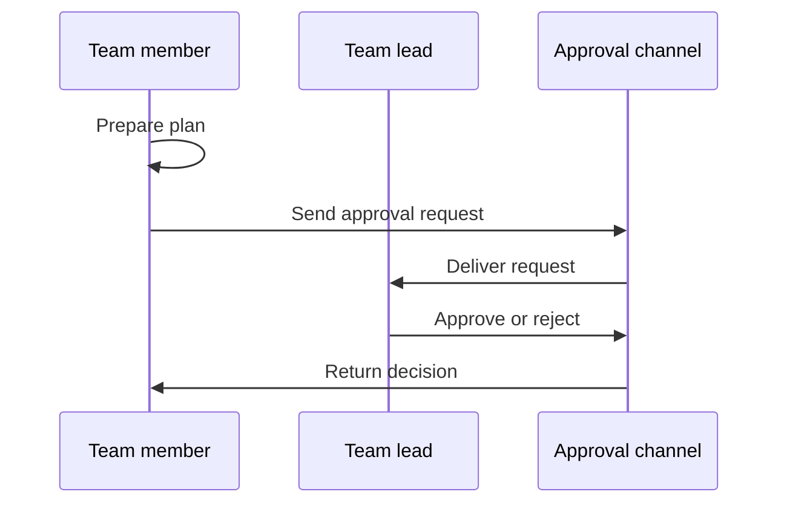
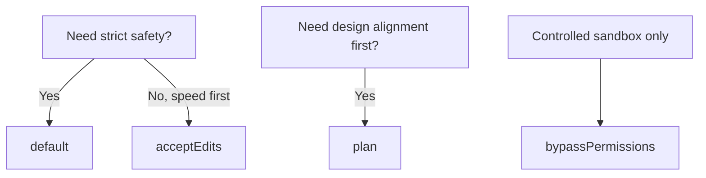

# Modes Diagrams

## 1) Execution vs Permission

```mermaid
flowchart LR
  A["Modes"] --> B["Execution"]
  A --> C["Permission"]

  B --> B1["Interactive"]
  B --> B2["Print"]
  B --> B3["Bare"]

  C --> C1["default"]
  C --> C2["plan"]
  C --> C3["acceptEdits"]
  C --> C4["bypassPermissions"]
  C --> C5["dontAsk"]
```

## 2) Common Daily Flow

```mermaid
flowchart TD
  A["Start"] --> B["Interactive"]
  B --> C["default permission"]
  C --> D["Read / Edit / Verify"]
  D --> E["Permission checks applied"]
```

## 3) Planning Flow

```mermaid
flowchart TD
  A["Default permission"] --> B["Enter planning"]
  B --> C["Explore and design"]
  C --> D["Request exit from planning"]
  D --> E{"Approved?"}
  E -->|Yes| F["Restore implementation mode"]
  E -->|No| G["Revise plan"]
  G --> C
```

## 4) Team Approval Flow

```mermaid
sequenceDiagram
  participant Member as Team member
  participant Lead as Team lead
  participant Channel as Approval channel

  Member->>Member: Prepare plan
  Member->>Channel: Send approval request
  Channel->>Lead: Deliver request
  Lead->>Channel: Approve or reject
  Channel->>Member: Return decision
```

## 5) Permission Selection

```mermaid
flowchart TD
  A["Need strict safety?"] -->|Yes| B["default"]
  A -->|No, speed first| C["acceptEdits"]
  D["Need design alignment first?"] -->|Yes| E["plan"]
  F["Controlled sandbox only"] --> G["bypassPermissions"]
```
