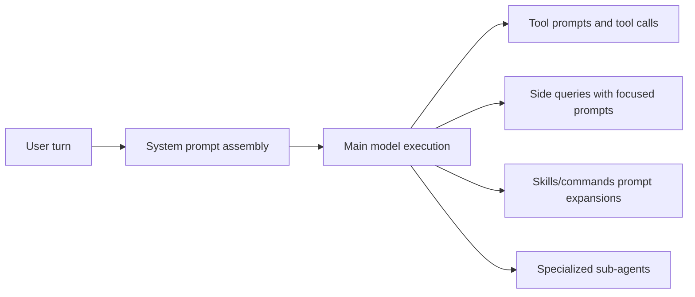

# Prompts in `src`: A Progressive Deep Dive

This document explains how prompts are used across `src`, when each prompt family runs, and how to write robust prompts for Claude Code.

The structure is intentionally progressive:
1. Start with the system-level mental model.
2. Move to prompt families and execution timing.
3. Finish with implementation-level writing patterns, pitfalls, and checklists.

## 1. System Mental Model

Prompts in this codebase are not a single block. They are a layered control surface:

- Global runtime behavior (assembled system prompt)
- Specialized side-query prompts (classification, summarization, extraction)
- Tool prompts (how a specific tool should be used)
- Command and skill prompts (workflow orchestration)
- Built-in agent prompts (delegated specialist behavior)

A practical way to reason about them is:

## 2. Prompt Layers and When They Run

## 2.1 Runtime System Prompt Assembly

Primary anchor:
- `src/constants/prompts.ts`

Core role:
- Define baseline behavior (tool usage rules, safety, communication style, execution discipline).
- Inject dynamic sections (environment, language preference, memory instructions, MCP instructions, feature-gated sections).

Key example:
- `DEFAULT_AGENT_PROMPT` is a compact baseline for agent execution behavior.

When it runs:
- At normal turn execution and agent execution setup.

Why it matters:
- Most downstream prompt quality depends on this baseline being precise and non-conflicting.

## 2.2 Memory and Instruction Injection

Primary anchors:
- `src/utils/claudemd.ts`
- `src/memdir/findRelevantMemories.ts`

Key prompts:
- `MEMORY_INSTRUCTION_PROMPT`
- `SELECT_MEMORIES_SYSTEM_PROMPT`

Core role:
- Clarify instruction precedence and memory usage boundaries.
- Select only high-signal memories for the current query.

When they run:
- Memory loading and memory recall selection paths.

Why it matters:
- Reduces instruction drift and prevents low-value memory noise.

## 2.3 Compact/Summarization Prompts

Primary anchor:
- `src/services/compact/prompt.ts`

Key prompts:
- `BASE_COMPACT_PROMPT`
- `PARTIAL_COMPACT_PROMPT`
- `PARTIAL_COMPACT_UP_TO_PROMPT`

Core role:
- Preserve context continuity as conversation history gets compacted.
- Force structured output blocks for deterministic post-processing.

When they run:
- Context compaction / summarization paths.

Why it matters:
- Directly impacts recovery quality after long sessions.

## 2.4 Suggestion and Session Retrieval Prompts

Primary anchors:
- `src/services/PromptSuggestion/promptSuggestion.ts`
- `src/utils/agenticSessionSearch.ts`
- `src/utils/sessionTitle.ts`
- `src/utils/teleport.tsx`

Key prompts:
- `SUGGESTION_PROMPT`
- `SESSION_SEARCH_SYSTEM_PROMPT`
- `SESSION_TITLE_PROMPT`
- `SESSION_TITLE_AND_BRANCH_PROMPT`

Core role:
- Generate next-input suggestions.
- Find semantically relevant historical sessions.
- Generate short session titles and teleport branch/title metadata.

When they run:
- Suggestion hooks, history search actions, title generation flows, teleport setup.

Why it matters:
- These prompts optimize UX and workflow continuity rather than direct code editing.

## 2.5 Tool Behavior Prompts

Primary anchors:
- `src/tools/AskUserQuestionTool/prompt.ts`
- `src/tools/BriefTool/prompt.ts`
- `src/tools/SleepTool/prompt.ts`
- `src/tools/ExitPlanModeTool/prompt.ts`

Key prompts:
- `ASK_USER_QUESTION_TOOL_PROMPT`
- `BRIEF_TOOL_PROMPT`
- `SLEEP_TOOL_PROMPT`
- `EXIT_PLAN_MODE_V2_TOOL_PROMPT`

Core role:
- Encode strict usage contracts for tools.
- Prevent misuse (for example, using AskUserQuestion to request plan approval instead of ExitPlanMode).

When they run:
- During tool schema/prompt exposure and tool invocation decisions.

Why it matters:
- Tool prompts are operational guardrails; weak wording here creates repeated model misuse.

## 2.6 Specialized Internal Side-Query Prompts

Primary anchors:
- `src/utils/permissions/permissionExplainer.ts`
- `src/services/toolUseSummary/toolUseSummaryGenerator.ts`
- `src/cli/handlers/autoMode.ts`
- `src/commands/insights.ts`

Key prompts:
- `SYSTEM_PROMPT` (permission explainer)
- `TOOL_USE_SUMMARY_SYSTEM_PROMPT`
- `CRITIQUE_SYSTEM_PROMPT`
- `FACET_EXTRACTION_PROMPT`
- `SUMMARIZE_CHUNK_PROMPT`

Core role:
- Produce constrained analysis artifacts (risk explanations, short mobile labels, rules critique, analytics facets).

When they run:
- Side-query tasks where a narrow model objective is required.

Why it matters:
- These prompts are task-specific; precision and output-shape constraints are more important than general creativity.

## 2.7 Commands and Skills as Prompted Workflows

Primary anchors:
- `src/commands/init.ts`
- `src/commands/review.ts`
- `src/skills/bundled/*.ts`

Key prompts:
- `NEW_INIT_PROMPT`, `OLD_INIT_PROMPT`
- `LOCAL_REVIEW_PROMPT`
- `SIMPLIFY_PROMPT`, `SKILLIFY_PROMPT`, `UPDATE_CONFIG_PROMPT`, `STUCK_PROMPT`, `SKILL_PROMPT` (remember)

Core role:
- Encode multi-phase workflows with concrete sequencing and constraints.

When they run:
- Explicit command or skill invocation.

Why it matters:
- These prompts often contain the highest workflow complexity and therefore need stronger structure.

## 2.8 Built-in Agent Specialization Prompts

Primary anchors:
- `src/tools/AgentTool/built-in/statuslineSetup.ts`
- `src/tools/AgentTool/built-in/verificationAgent.ts`
- `src/components/agents/generateAgent.ts`

Key prompts:
- `STATUSLINE_SYSTEM_PROMPT`
- `VERIFICATION_SYSTEM_PROMPT`
- `AGENT_CREATION_SYSTEM_PROMPT`

Core role:
- Define specialist agents with strict scope and high procedural reliability.

When they run:
- Sub-agent invocation paths or agent-generation flows.

Why it matters:
- Agent prompts must be explicit about authority boundaries, required evidence, and forbidden actions.

## 3. Writing Patterns Used in This Codebase

## 3.1 Constrain Goal First, Then Procedure

A repeated pattern is:
- one-sentence mission
- execution steps
- explicit output contract

This appears in `verification`, `init`, `skillify`, `compact`, and `insights` prompts.

## 3.2 Encode Failure Modes Directly

Strong prompts explicitly call out failure patterns to avoid, for example:
- verification avoidance
- happy-path overfitting
- incorrect approval flow in plan mode

This sharply reduces ambiguous behavior.

## 3.3 Separate Policy from Runtime Variants

`src/constants/prompts.ts` uses a static/dynamic split and boundary marker (`SYSTEM_PROMPT_DYNAMIC_BOUNDARY`) to avoid cache fragmentation and mixed responsibilities.

Practical rule:
- Keep stable instruction text in static sections.
- Put session-specific, environment-specific, or feature-gated content in dynamic sections.

## 3.4 Use Structured Output Requirements for Machine-Consumed Paths

Where output is consumed by code, prompts require strict formats:
- JSON schema-constrained outputs
- exact verdict lines (`VERDICT: PASS|FAIL|PARTIAL`)
- specific sections/tags (`<analysis>`, `
`)

This pattern appears in verification, session titling, memory selection, and compact flows.

## 3.5 Prefer Operational Language Over Abstract Guidance

The strongest prompts specify:
- exact commands to run or command shape
- minimum evidence required
- what counts as PASS/FAIL
- when to escalate or ask user

This reduces interpretation drift and makes behavior testable.

## 4. Progressive Prompt Design Template (Shallow to Deep)

Use this template when adding or rewriting prompts:

1. **Objective (shallow)**
- What exact outcome should this prompt produce?

2. **Trigger and Scope (shallow)**
- When does it run?
- What is in scope and out of scope?

3. **Procedure (middle)**
- Ordered steps.
- Required checks.

4. **Output Contract (middle)**
- Required format.
- Schema or section names.

5. **Failure Controls (deep)**
- Known failure patterns.
- Explicit anti-pattern instructions.

6. **Evidence Standard (deep)**
- What proof is required before reporting success?

## 5. Common Failure Modes and How to Prevent Them

1. Ambiguous authority boundaries
- Symptom: prompt edits files in a verification-only path.
- Prevention: explicit "MUST NOT" constraints and disallowed tools.

2. Soft output contracts
- Symptom: prose where JSON/verdict is expected.
- Prevention: force strict schema or exact line format.

3. Workflow branch confusion
- Symptom: prompt asks for plan approval via wrong tool.
- Prevention: encode tool routing rules with explicit "do not use X for Y".

4. Overly broad memory selection
- Symptom: noisy memory recall.
- Prevention: selective criteria and explicit empty-list acceptance.

5. Summary drift in long sessions
- Symptom: compact outputs miss recent user intent.
- Prevention: "recent-only" variants and required section structure.

## 6. Checklist for Prompt Changes

Before merge:
- Is this prompt attached to a clearly named execution path?
- Is output shape deterministic if machine-consumed?
- Are disallowed behaviors explicit?
- Are failure modes documented in the prompt text?
- Does it duplicate policy that already exists elsewhere?
- Is wording concise enough to reduce token bloat?

After merge:
- Validate trigger conditions in real flow.
- Validate output parsing on both success and failure cases.
- Spot-check edge cases that the prompt explicitly claims to handle.

## 7. Quick Reference: High-Impact Prompts to Read First

If you are new to prompt internals, read these in order:

1. `src/constants/prompts.ts`
2. `src/services/compact/prompt.ts`
3. `src/tools/AgentTool/built-in/verificationAgent.ts`
4. `src/tools/AskUserQuestionTool/prompt.ts`
5. `src/memdir/findRelevantMemories.ts`
6. `src/commands/init.ts`

That sequence gives a reliable "architecture to operations" path.
